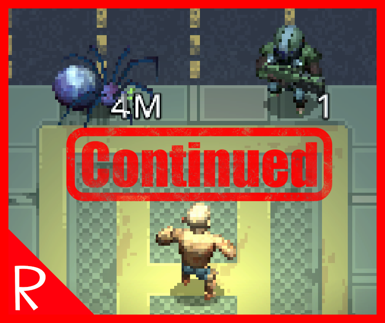

# Display Enemy Movement Speed - Continued...

# Functionality
For the people constantly right clicking on enemies to not get owned by 3AP melee goons. 
Shows the amount of action points an enemy can spend. If the enemy is melee only, an 'M' will also be displayed.

Toggleable with the comma key, rebindable with a config file.

# Continued Notes
This is a continuation of GitHub user [jamsge's](https://github.com/jamsge) fantastic mod of the same name.
If the original author comes back, this mod will be removed in favor of their mod listing.

# Alternative Version
Cryano has made versions of this mod with improved graphics and additional information.  

[Display Enemy Movement Speed Continued - UI [Hover Version]](https://steamcommunity.com/sharedfiles/filedetails/?id=3422733738)  
[Display Movement Speed - UI \[Permanent Version\]](https://steamcommunity.com/sharedfiles/filedetails/?id=3426072300)  

Personally I run this mod and their Hover version together.

## Config
To rebind the comma key toggle, go to:
`%UserProfile%\AppData\LocalLow\Magnum Scriptum Ltd\Quasimorph_ModConfigs\QM_DisplayMovementSpeedContinued\config.json`
and change "Comma" [with a Unity Keycode of your choice (scroll down to the Properties section)](https://docs.unity3d.com/ScriptReference/KeyCode.html).

# Text Issue
There is a known issue where the text might be slightly covered or discolored. This is due to a change in how 0.8.5 renders units and may be addressed in future game updates.

## Source
https://github.com/NBKRedSpy/QM-DisplayMovementSpeedContinued

## Credits
["Continued" font created with textstudio.com](https://www.textstudio.com/)

## FAQ
***I ran into an bug, what do I do?***
If you run into issues, please let me know through comment or forum post with details so I can try to make fixes.

***Can you make XYZ feature?***
I can't guarantee anything, but please feel free to leave a comment or forum post with suggestions.

*** I can't find the config file! What do I do? ***
You need to run the game at least once for a config file to generate

# Change Log
## 1.1.0

* Created this continuation mod.
* Quasimorph 0.8.5 compatibility.
* Added "M" for melee.
